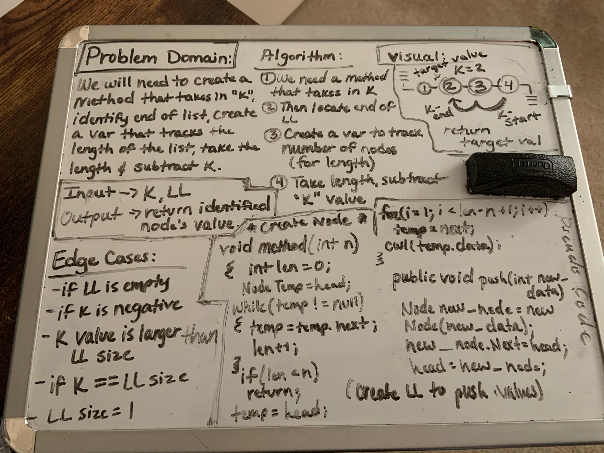

# Singly Linked List
- This introduces how to create LL classes, how to traverse them and how to write unit tests for their methods.

## Challenge
- Create a method called insert that will take in any value as an argument and then adds a new node w/ that value to the head of the list. (with an O(1) Time performance).
- Define a method called includes which takes any value as an argument and returns a boolean result that depends on if values exists as a Node's value somewhere within the list.
- Define a method called "toString" which will take no arguments and returns a string.

## Approach & Efficiency
- To be able to traverse out LinkedLists we utilized a while loop: Time O(n) in this case, because it will go through the whole LL every single time. Space: O(1), because nothing is returned.

## API
- All the 4 methods within the LinkedLists are public and can be accessed as so.

# Append, insertAfter, insertBefore
- Still within the linked list, we are now appending, inserting before and after.

## Challenge:
- Create 3 new methods. 
- Append: create a new node with our given value to the end of the list
- insertBefore: creates a new node with our given value and looks to place it after the node with the value we are seeking.
- insertAfter: creates a new node with our given value and places it immeditately after our first value node, then changes the next property.

- 

## API
- Public methods: toString, RecursiveToString, Includes, Insert, Append, InsertAfter, InsertBefore

## K-th From End
- This introduces us to how creating LinkedList classes work, how to traverse them and how to write unit tests for each method

## Challenge:
- Write out a method for the LL class which takes in a number (k), as a parameter. Return then node's value that is k from the end of the linked list.

## Approach & Efficiency
- Set a current node to the head of the list, set a counter variable. Iterate through your linkedlist incrementing the counter each time to find the length of the full ll.
- Use this value to make an array of that length. Loop over the LL again, assigning each of your elements to the value of each node.
- Return value of this array at the last index value (k). Traverse the LL by using a while loop. Time: O(n) because it goes through the list every single time. 

## Visual:

## LL-Zip List:

## Challenge:
- Write out a function that takes in 2 LL, and "zips" them together so that the output is 1 LL changing both LL values in alternating order.

## Approach & Efficiency:
- Create variables for 2 linked lists (to keep track of)
- Iterate through while loop that works when CurrentA is not equal to null 
- If currentB.Next != null, set temp to currentA.next
- set currentA.next to currentB
- set currentA.next.next to temp
- then increment both currents
- instantiate through second while loop that works when currentB is not equal to null
- again, set currentA == currentB
- Increment both currents
- return "ListA"

## Visual

