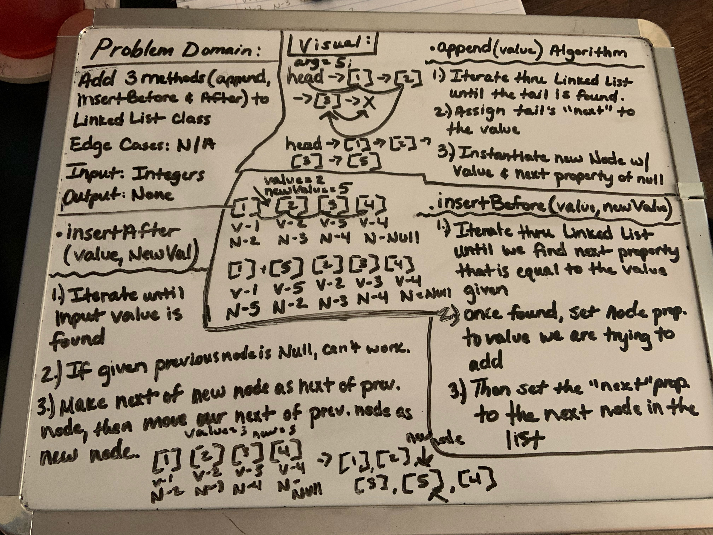

# Singly Linked List
- This introduces how to create LL classes, how to traverse them and how to write unit tests for their methods.

## Challenge
- Create a method called insert that will take in any value as an argument and then adds a new node w/ that value to the head of the list. (with an O(1) Time performance).
- Define a method called includes which takes any value as an argument and returns a boolean result that depends on if values exists as a Node's value somewhere within the list.
- Define a method called "toString" which will take no arguments and returns a string.

## Approach & Efficiency
- To be able to traverse out LinkedLists we utilized a while loop: Time O(n) in this case, because it will go through the whole LL every single time. Space: O(1), because nothing is returned.

## API
- All the 4 methods within the LinkedLists are public and can be accessed as so.

# Append, insertAfter, insertBefore
- Still within the linked list, we are now appending, inserting before and after.

## Challenge:
- Create 3 new methods. 
- Append: create a new node with our given value to the end of the list
- insertBefore: creates a new node with our given value and looks to place it after the node with the value we are seeking.
- insertAfter: creates a new node with our given value and places it immeditately after our first value node, then changes the next property.

- 

## API
- Public methods: toString, RecursiveToString, Includes, Insert, Append, InsertAfter, InsertBefore

