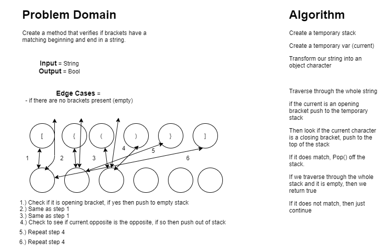

ingly Linked List
- This introduces how to create LL classes, how to traverse them and how to write unit tests for their methods.

## Challenge
- Create a method called insert that will take in any value as an argument and then adds a new node w/ that value to the head of the list. (with an O(1) Time performance).
- Define a method called includes which takes any value as an argument and returns a boolean result that depends on if values exists as a Node's value somewhere within the list.
- Define a method called "toString" which will take no arguments and returns a string.

## Approach & Efficiency
- To be able to traverse out LinkedLists we utilized a while loop: Time O(n) in this case, because it will go through the whole LL every single time. Space: O(1), because nothing is returned.

## API
- All the 4 methods within the LinkedLists are public and can be accessed as so.

# Append, insertAfter, insertBefore
- Still within the linked list, we are now appending, inserting before and after.

## Challenge:
- Create 3 new methods. 
- Append: create a new node with our given value to the end of the list
- insertBefore: creates a new node with our given value and looks to place it after the node with the value we are seeking.
- insertAfter: creates a new node with our given value and places it immeditately after our first value node, then changes the next property.

- 

## API
- Public methods: toString, RecursiveToString, Includes, Insert, Append, InsertAfter, InsertBefore

## K-th From End
- This introduces us to how creating LinkedList classes work, how to traverse them and how to write unit tests for each method

## Challenge:
- Write out a method for the LL class which takes in a number (k), as a parameter. Return then node's value that is k from the end of the linked list.

## Approach & Efficiency
- Set a current node to the head of the list, set a counter variable. Iterate through your linkedlist incrementing the counter each time to find the length of the full ll.
- Use this value to make an array of that length. Loop over the LL again, assigning each of your elements to the value of each node.
- Return value of this array at the last index value (k). Traverse the LL by using a while loop. Time: O(n) because it goes through the list every single time. 

## Visual:

## Implementation: Stacks and Queues

## Challenge:
- Create a stack that has one property and 4 methods combined. Test to confirm 
- Create a queue that has one property and 4 methods. Test to confirm
 
## Approach & Efficiency:
- Create a stack class with a top property. Assign an empty value to top when the stack is created.
- Create a method called push which will take any values to the top with an O(1) time performance.
- Create a method called pop that does not take any argument, removes node from the top and returns value
- Cretae a method called peek that does NOT take an argument and returns the value of the node located on top.
- Create a method isEmpty that takes no arguments, returns bool.
- Create a queue class with property of front.
- Create a method called enqueue that takes any value as argument, adds a new node w/ value to the back of the queue w/ O(1) performance.
- Create a method called dequeue that does NOT take any argument, removes node from the front of the queue and returns node value.
- Create a method called peek that does NOT take any arguments and returns value of node located in front of the queue, exception handle should be raised if empty
- Create a method isEmpty that takes no arguments and returns bool, indicating empty or not empty queue

## API:
- Public Methods:
- Pop(), Push(), IsEmpty(), Peek(), Enqueue(), Dequeue()
Public Classes:
- Queue, Stack

## Queues with Stacks

## Challenge:
- Create a "PseudoQueue" class that will utilize two stacks that will then iterate through, creating enqueuing.

## Approach & Efficiency:
- We iterate all the way through "stack one", the original stack. Popping each node into stack two (dequeued stack)
- Get the remaining node left in Stack One.
- Reorder the nodes by using Pop() for each one. Go through each node in stack two like this and place back into stack one through a for loop?
- Return the LAST node.

## Visual:

## Fifo Animal Shelter

## Challenge:
- Create an animal shelter that can take in dog and cat objects and return the specified/preferred types input during dequeuing.

## Approach & Efficiency:
- Set up a temp that is equal to queue
- Iterate through nodes while temp current != null
- Check if each node is of the preferred species (dog or cat) by dequeuing and then enqueue our front entries to see value/object. Then we do that all the way through until everything is done.
- Then reset all of the nodes to their original state by iterating through until our front node equals the temp. 
## Visual

## Multi Bracket Validation

# Challenge:
- Create a method that verifies if brackets have a matching beginning and end in a string

## Approach & Efficiency:
- Create a temporary stack
- Then create a temporary var (current)
- Transform our string into an object character
- Traverse through the whole string
- if the current is an opening bracket push to the temporary stack 
- Then look if the current character is a closing bracket, push to the top of the stack
- If it does match, Pop() off the stack.
- If we traverse through the whole stack and it is empty, then we return true
- If it does not match, then continue until string is empty or everything has been pushed out.
- Big O: 
- Time: O(n)
- Space: O(n)

## Visual

# Repeated Word

## Challenge:
- Taking a string as input, return the first word that is repeated within the string.

## Approach & Efficiency:

- Create a temporary "tracker" in the form of a list?
- Remove any punctuation from within the string and then split it 
- Then loop through the string array, to check if the tracker list contains any words, return the word if so.
- If not, then return the word to the tracker list
- After full loop through the tracker list, return an empty string with no repeated words

## Visual

