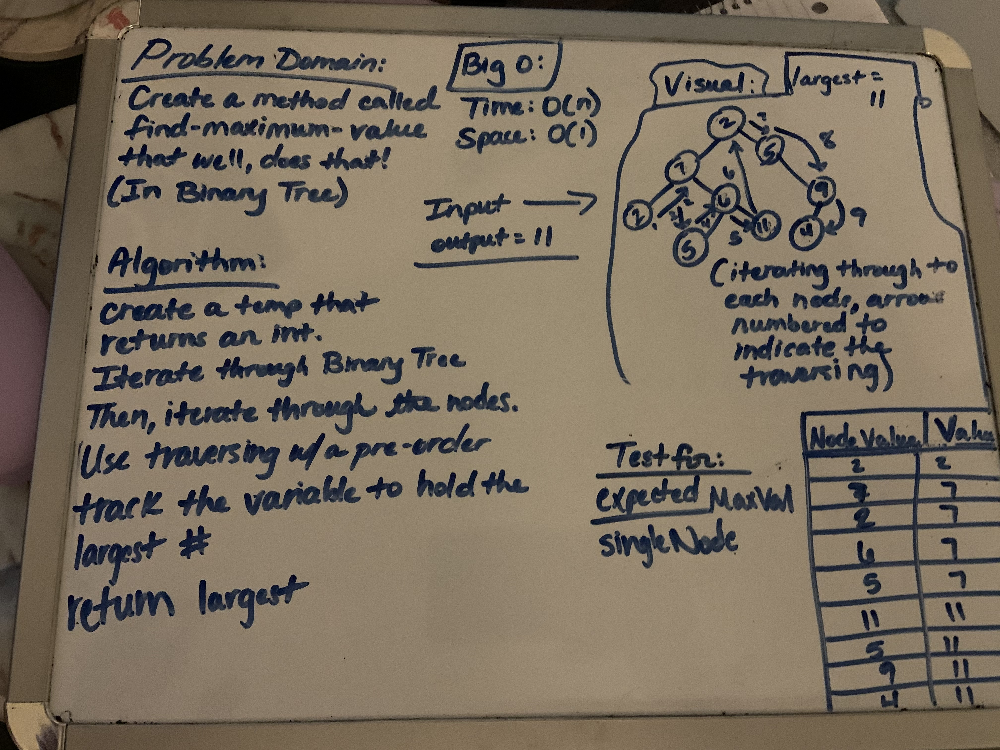
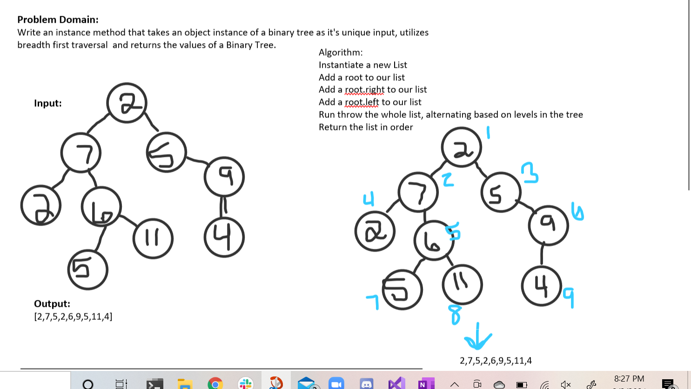
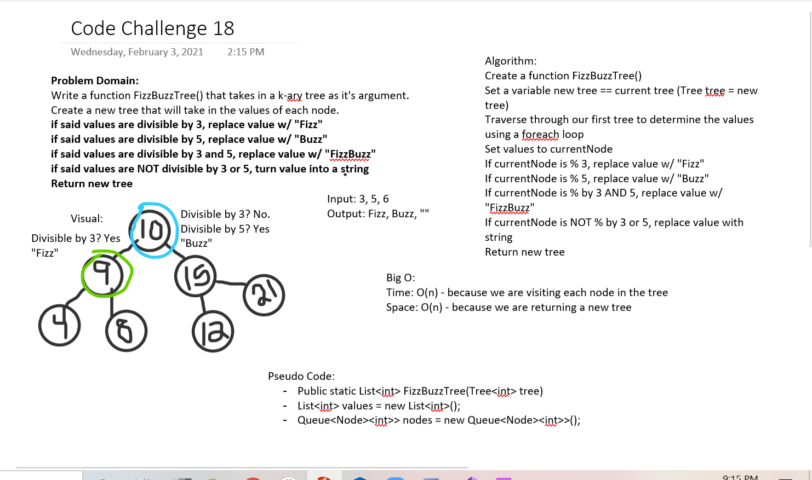

# Binary Trees

## Author: Jordan Kidwell

## Problem Domain:

- Create a Node class that will contain properties for the value stored in the node and for the left/right child nodes

- *Create a Binary Tree Class*:
    - Create a method for each of the "depth first" traversals preOrder, inOrder and postOrder, which will return an array of the values. Array of values will be sorted appropriately based on which method is being called.
    - All exceptions or errors thrown should come from within the code and should be semantically correct. No default errors thrown from the language.

- *Create a Binary Tree Search Class*:
    - Create a method "add" that will accept a value and then add a new node with said value in the correct location of the tree.
    - Create a method "contains" that will accept a value and return a bool indicating whether or not the value sought after is in the tree at least once. 
 
## Inputs & Outputs to be expected:

- Binary Tree(preOrder) -> [A,B,D,E,C,F,G]
- Binary Tree(inOrder) -> [D,B,E,A,F,C,G]
- Binary Tree(postOrder) -> [D,B,E,F,G,C,A]
- Binary Search Tree (Add) Root of 30 (Value 20) -> placed on Left side
- Binary Search Tree (Contains) 23 -> True or False

## Big O:
- Binary Tree: O(n)
- Binary Search Tree O(1)

## Max Value

## Problem Domain:
- Create a method that's called "find-maximum-value". W/O using any of our normal built in methods, return the max value stored in the tree. Assuming the values will be numeric.

## Inputs & Outputs:
- Input: Tree [23, 169, 185, 200, 14, 95] 
- Output: 200

## Big O:
- Time: O(n)
- Space: O(1)

## Visual

## Breadth First:

## Problem Domain:
- Write an instance method that takes an object instance of a binary tree as it's unique input, utilizes breadth first traversal  and returns the values of a Binary Tree.

## Big O:
- Time: O(h)
- Space: O(1)

## Visual:

## FizzBuzzTree

## Problem Domain:
- Write a function FizzBuzzTree() that takes in a k-ary tree as it's argument. Create a new tree that will take in the values of each node.

## Big O:
- Time: O(n)
- Space: O(n)

## Visual:

